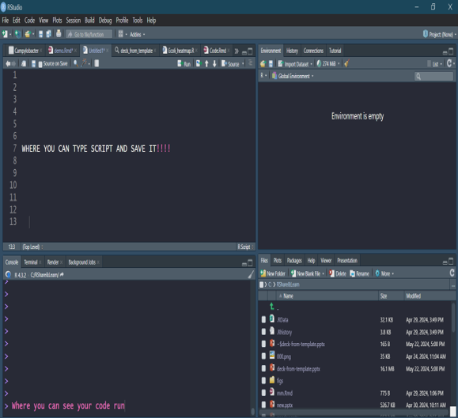
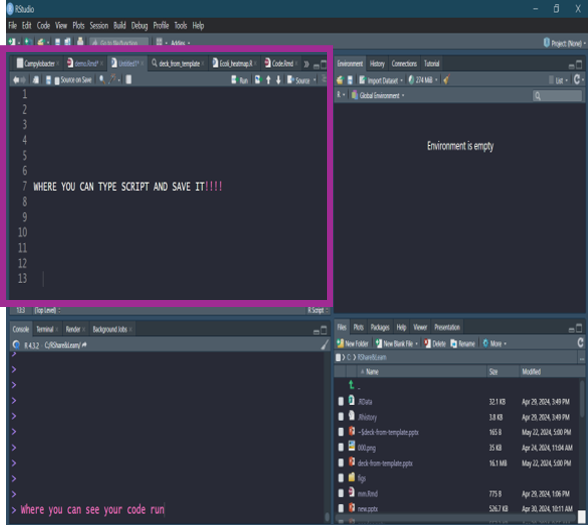
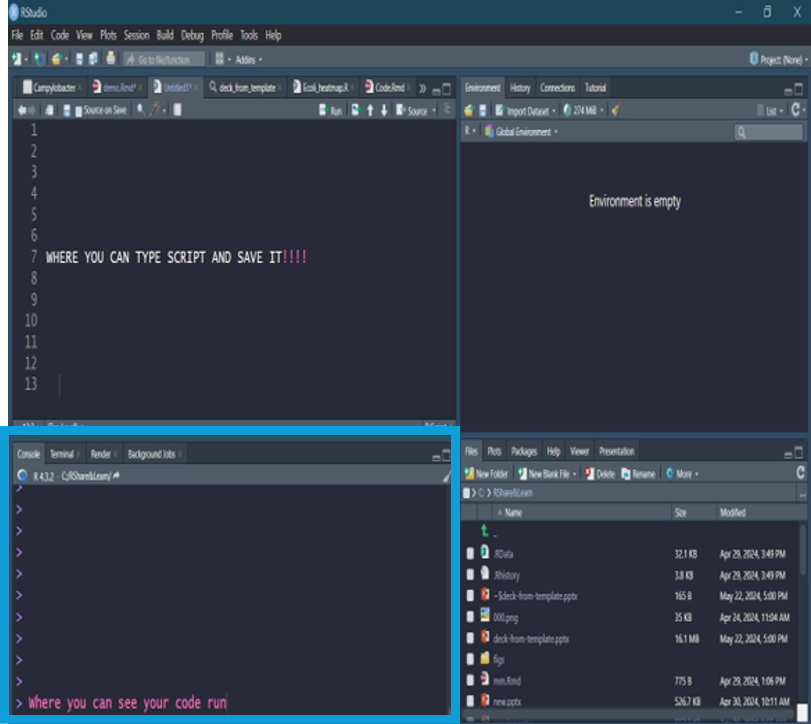
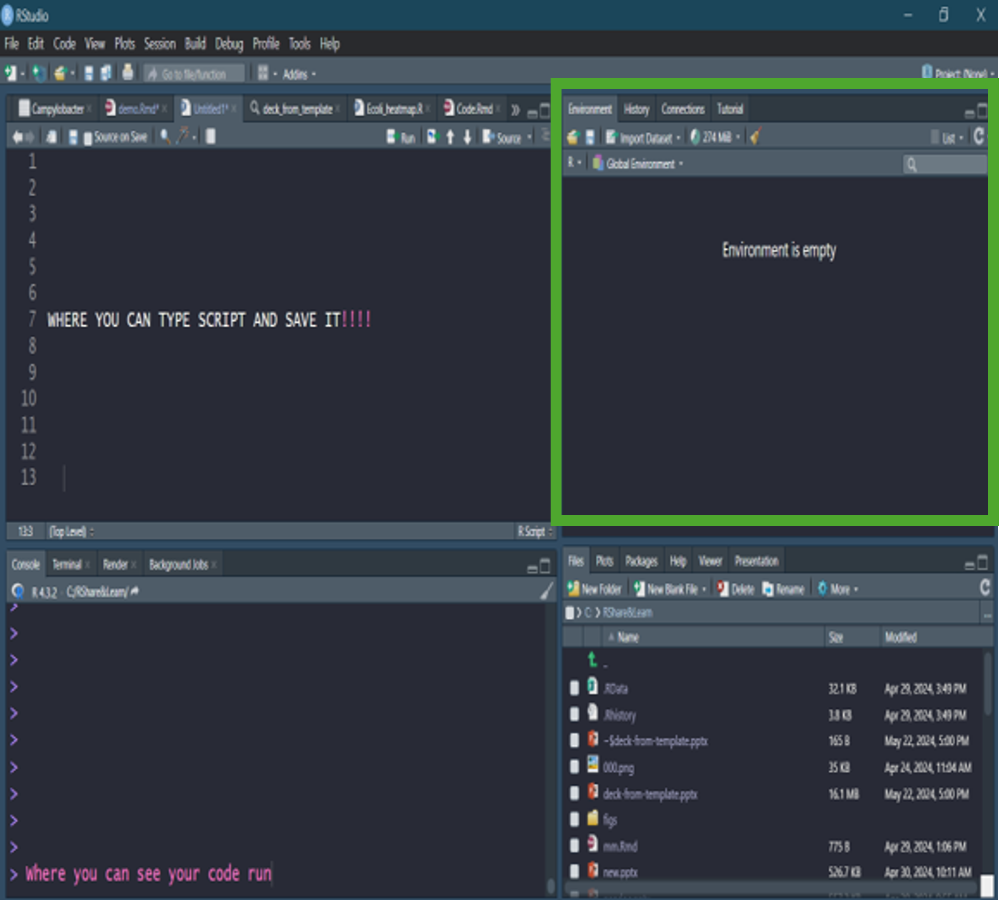
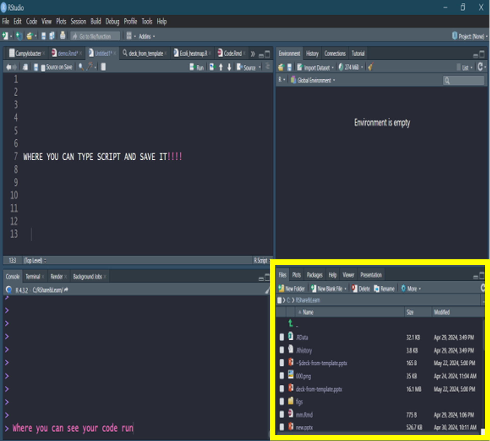
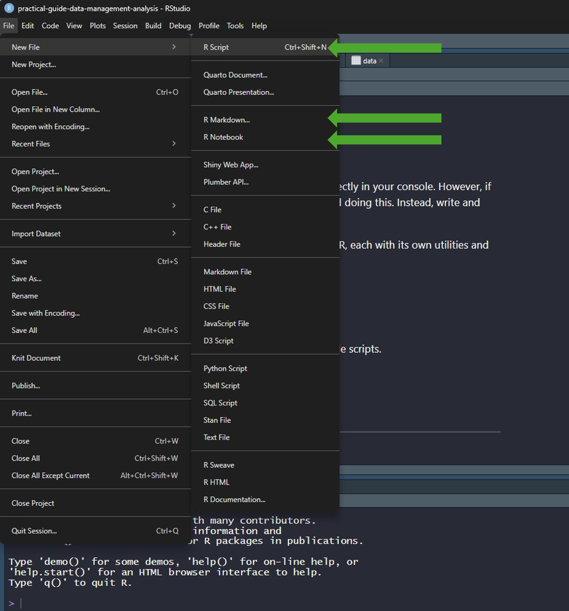

> # First-time User:
>
> -   Download:
>
>     -   R 4.4.3
>
>     -   RStudio

**RStudio** is an integrated development environment (aka visualizes what you're coding).

{width="479"}

**It is comprised of 4 quadrants:**

# 1. Top Left

Savable script, with the ability to have multiple scripts open at once.

{width="477"}

# 2. Bottom Left

-   Console tab - where you can see the code run, outputs, messages, and errors.

-   [Terminal tab]{style="color:#888B8D"} - execute shell commands (basically non-R code related to your computer, e.g. used for setting up Version control).

-   [Render tab]{style="color:#888B8D"} - where you can see the code run for rmarkdown and shiny components (e.g. html, pdf, and word outputs).

-   [Background jobs tab]{style="color:#888B8D"} - shows the status, progress and outputs.

{width="501"}

# 3. Top Right

-   Environment tab - this will display what is loaded in your environment and readily available for use within your code (e.g. data frames, functions, lists).

-   History tab - this will display your working history (e.g. what code has been run before).

-   [Connection tab]{style="color:#888B8D"} - this will display any servers or databases you're connected to.

-   Git tab - access to commits, push, and pull (See Version Control section).

-   [Tutorial tab]{style="color:#888B8D"} - through the `learnr` package, this tab will run tutorials for RStudio.

{width="513"}

# 4. Bottom Right (Your Best Friend)

-   File tab - this will display your working directory with all the files and script files you can import into R.

-   Plot tab - this will display plot outputs.

-   Packages tab - this will display existing packages installed and whether they are loaded. You can also install new packages, and look up documentation attached to the package.

-   Help tab - this feature allows your to search through a package that you've installed for instructions on how to set up functions.

-   [Viewer tab]{style="color:#888B8D"} - this will display your html outputs (e.g. rmd script file)

-   [Presenter tab]{style="color:#888B8D"} - this will display your powerpoint outputs.

{width="500"}

# Script Files

Technically, you can write and run each line of code directly in your console. However, if you think you may ever want to re-run your code, avoid doing this. Instead, write and run your code in a script and save it for future use.

{width="457"}

There are a several different methods for writing scripts in R, each with its own utilities and advantages. Below, I've describe the main 3 commonly used ones:

## 1. R Script File (.R)

-   Great for straightforward coding workflows and reusable scripts.

-   Output is displayed in the console.

-   Commonly used for:

    -   Data cleaning

    -   Wrangling

    -   Creating functions

## 2. R Notebook (.Rmd)

-   Combines code, output, and notes in an interactive format.

-   Output is displayed in the script file

-   Useful for:

    -   Exploratory analysis

    -   Learning

    -   Documenting coding process

## 3. R Markdown (.Rmd)

-   Designed for creating polished, reproducible reports that combines text, code, and output.

-   Output is displayed in the script file

-   Used for:

    -   Sharing analyses (like a report or comms)

    -   Generating HTML/PDF/Word documents

Personally, I use all three of these file types regularly. This will be discussed in more depth in a later section, but in short, I tend to use R Notebooks when I’m exploring a new dataset or initial analyses. R Scripts are useful for creating reusable lists (such as breakpoints used throughout an analysis), writing functions, or even acting as “scrap paper” where I sketch out the structure of a code chunk. Markdown files are ideal for creating outputs 😎 or generating reports with tables and graphs in PDF or Word format.
