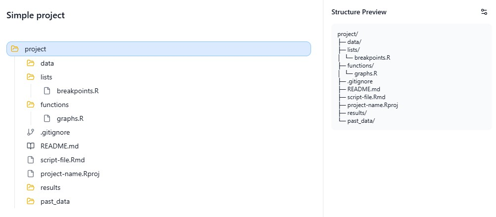
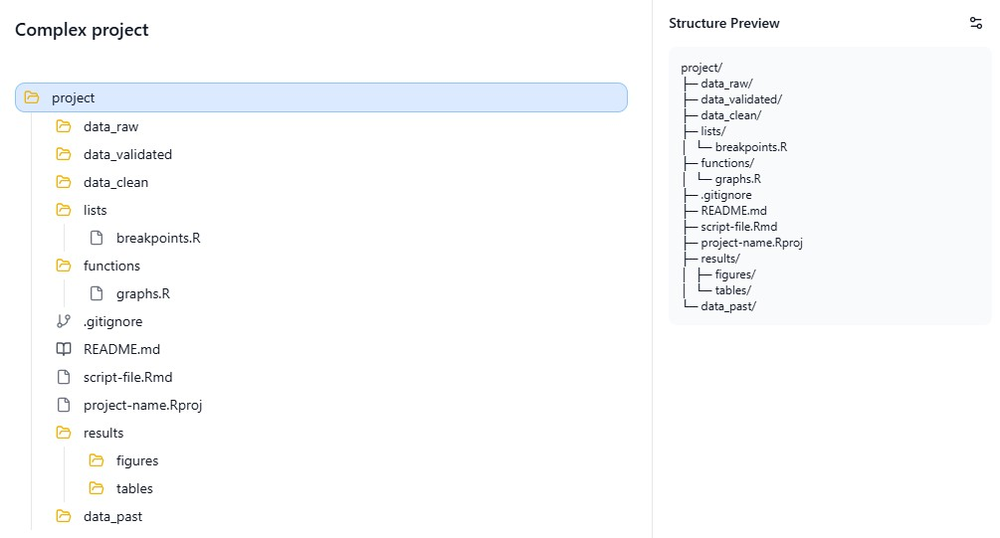

This section might raise some eyebrows, so I’d like to preface that workflow organization is highly dependent on personal preference. That said, I’m going to illustrate my own workflow and explain the reasoning behind it.

# Step 1: Code Objective

a.  If the objective of your R code is short-term — such as performing a quick check or generating a one-time output — using a single R script file (`.R`) is usually sufficient, and you can likely skip the following steps.

b.  However, if your code is intended for longer-term or ongoing use — such as projects that generate recurring outputs weekly, quarterly, or annually, and may involve multiple datasets — it is worth setting up an R Project (`.Rproj`) and continuing through the following steps.

*Why?* An `.Rproj` file sets up a self-contained environment - think of it as a home base for your project. When you open an `.Rproj` file, the working directory is automatically set to the project's folder, keeping your scripts, data, and outputs connected to one place. This allows you to use **relative file paths** (re: rant on file paths). As long as you have the full project folder, imports and export functions will work regardless of where the project is stored on your computer.

# Step 2: Version Control

For the majority of cases, setting up version control is important. Regardless of whether you plan to "publish" your repository on `GitHub`, using `Git` can save a lot of headaches when working through drafts, testing changes, or revising code over time.

a)  If your project is relatively simple, requires very little revising, and involves no collaboration, version control may not be necessary - you can skip to **Step 3**.

b)  If your project is not collaborative and you are concerned about security (even with a private respository), consider using `Git` locally without publishing to GitHub. Version control will remain on your computer, while still giving you the flexibility to publish the repository later if collaboration becomes necessary.

c)  If your project is collaborative (or may become collaborative in the future), consider setting up version control with `Git` and collaborating through `GitHub`.

🚩[**Concerned about security?**]{style="color:red;font-weight:bold;"}🚩

-   Keep your repository **Private**.

-   Using `.Rproj` helps avoid hard-coded absolute file paths from being exposed or shared unintentionally.

-   Don't `push` your data on `GitHub` (the structure will be explained in **Step 3**).

    -   This can be manually done each time you `push` from GitHub Desktop.

        OR

    -   Use `.gitignore` which lists all the items to be ignored when `push`ing onto the cloud. To set-up `.gitignore` see Version Control - On-going User - Create a new repository through GitHub Desktop. In `.gitignore` file add:

        -   `folder_name/*` to ignore all items in folder

# Step 3: Workflow Structure

This can be completely up to preference but I like to organize my project folder with designated sub-folders, and depending on the project I may split into more or less folders.

## Simple project

When data is already validated and just requires some minor cleaning and wrangling.

## Complex project

When data is needs validation or requires significant cleaning and wranging.

