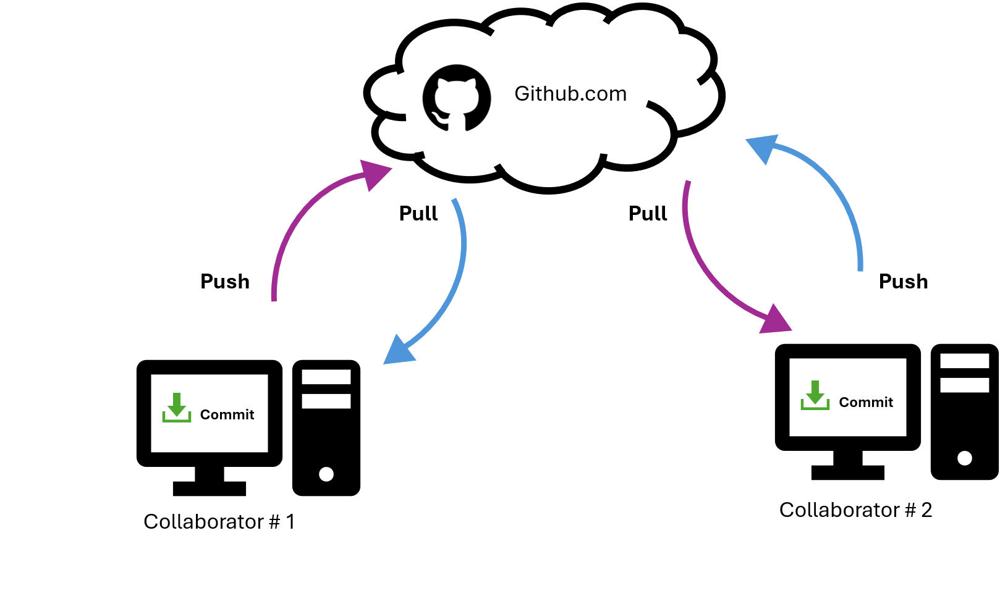
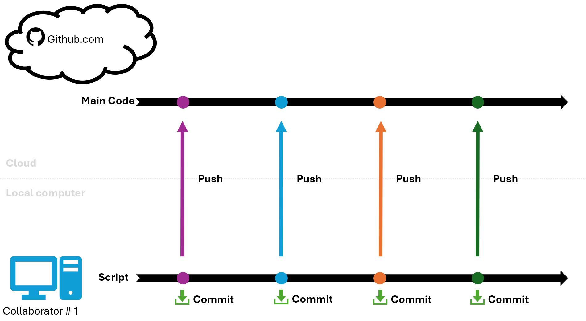
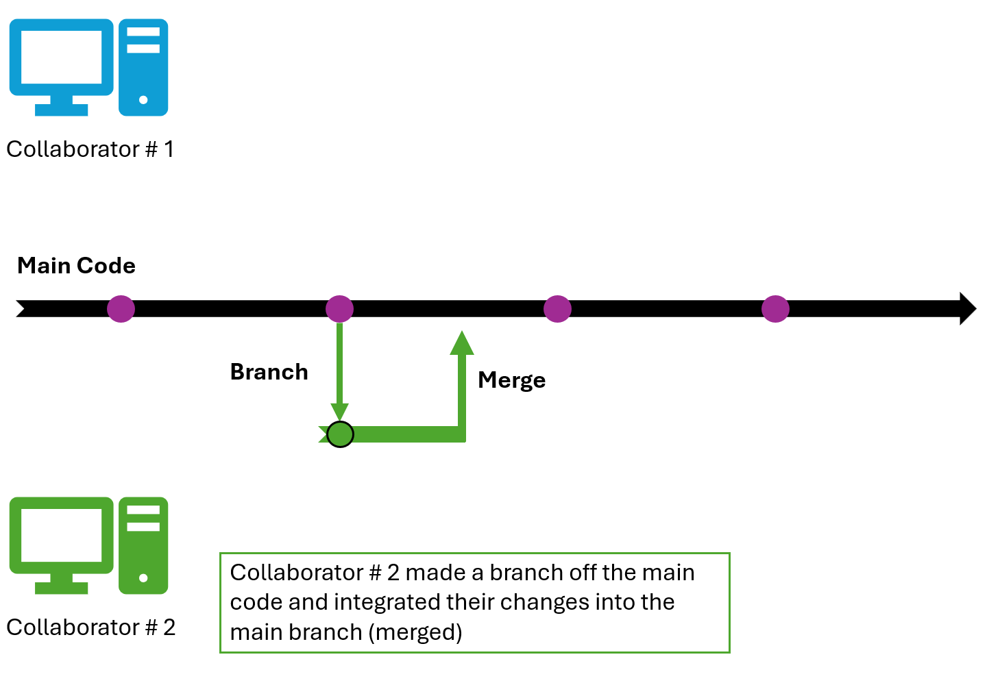
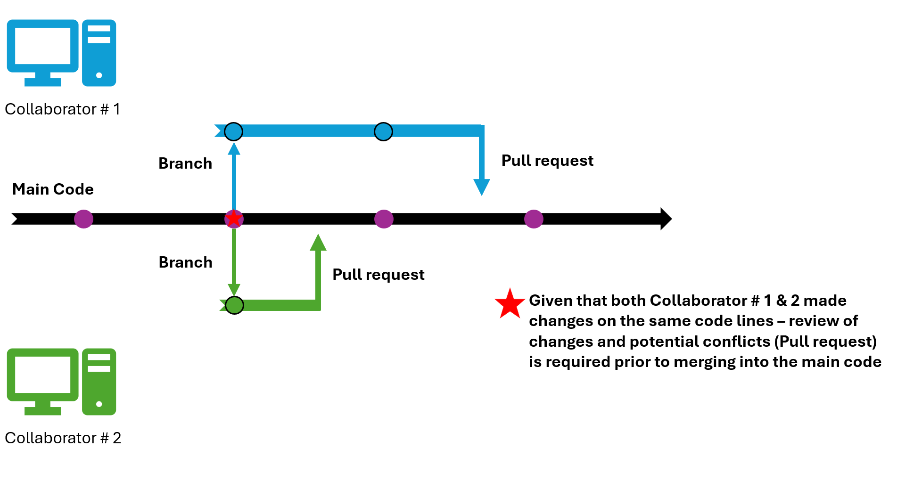

> **Sources for this section**
>
> [What is Version Control?](https://github.com/resources/articles/what-is-version-control)
>
> [Let's Git started \| Happy Git and GitHub for the useR](https://happygitwithr.com/)

Do you...

-   Have issues with sharing code with a colleague?

-   Have multiple versions of code saved because you're worried about losing historical versions?

-   Want to work on a project simultaneously with a colleague?

**Version control** might be useful to you! Imagine a google word doc system for code. It streamlines code development and mitigates lost work and time by tracking changes, enabling multiple people to collaborate simultaneously, identifying conflicting edits, and prevents accidental overwrites.

# Basic features

-   **Repository**: A centralized database that stores the complete collection of files and folders for a project, along with the revision history.

-   **Commit**: A "snapshot" of changes that are tagged and identified - these are changes saved on your local computer.

-   **Push**: This saves your commit to the cloud (i.e. visible on your Github.com repository and to other collaborators).

    

-   **Pull**: This grabs any commits that were *pushed* onto the cloud (i.e. changes made by other collaborators).

-   **Branch**: A code that has branched into a separate, parallel version of the main code. This is useful for collaborators to work independently without changing the main code.

-   **Merge**: When users combine code edits and integrate changes from on branch into another or into the main code.

-   **Pull Request**: Mechanism used to propose, notate, review, and discuss changes in code before they merge into the main code.

-   **Conflict**: Ability to identify and resolve conflicting edits or changes among multiple collaborators.

Note: these steps are slightly dramatized in the diagrams. One of the nice features of GitHub is that it guides users through the workflow with prompts for the next steps. For example, after you **Commit**, GitHub will typically suggest a **Push**. If it detects changes from another collaborator or a conflict, a **Review Pull Request** prompt will appear.

This section will go through:

1.  [How to set-up as a first user](first-time.qmd)
2.  [General use as a on-going user](on-going.qmd)
